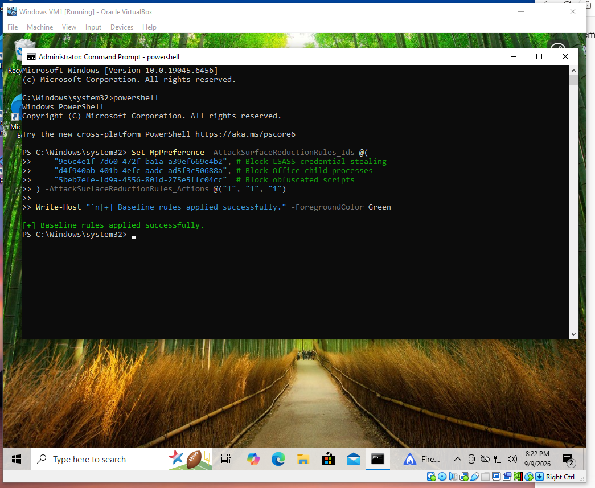
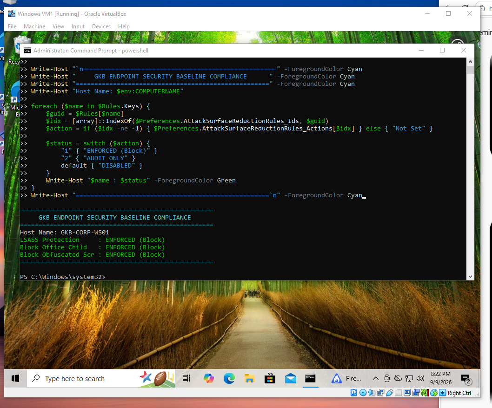

# Enterprise Endpoint Defense & Zero-Day Mitigation Lab
**Environment:** Gatekeeper Bank (Virtual Branch Infrastructure)  
**Host Target:** `GKB-CORP-WS01` (Windows 10 Pro)  
**Security Framework:** Microsoft Defender for Endpoint (MDE) & Attack Surface Reduction (ASR)  

---

## 1. Project Overview
This repository documents an enterprise-grade endpoint security baseline, threat-hunting telemetry capture, and zero-day defense-in-depth engineering workflow. The project models an operational banking branch workstation subject to credential theft attempts and unpatched elevation-of-privilege exploits.

### Core Objectives
* Implement and audit host-level Attack Surface Reduction (ASR) rules via PowerShell.
* Simulate a Living-off-the-Land (LotL) credential access technique using native Windows utilities (`rundll32.exe` / `comsvcs.dll`).
* Capture and triage local Defender behavioral event telemetry (Event ID 1116 / 1121).
* Author Advanced Hunting KQL detection queries for enterprise SIEM/EDR pipelines.
* Implement interim compensating controls against the unpatched **ShieldCrash** zero-day vulnerability (CVE-2026-69414 bypass).

---

## 2. Baseline Configuration & Enforcement
The host baseline enforces three high-impact Attack Surface Reduction rules designed to shut down typical initial-access and lateral-movement techniques:

| Rule Name | Rule GUID | Target MITRE Technique | State |
| :--- | :--- | :--- | :--- |
| **Block LSASS Credential Theft** | `9e6c4e1f-7d60-472f-ba1a-a39ef669e4b2` | T1003.001 (LSASS Memory) | Block (`1`) |
| **Block Office Child Processes** | `d4f940ab-401b-4efc-aadc-ad5f3c50688a` | T1059 (Command & Scripting) | Block (`1`) |
| **Block Obfuscated Scripts** | `5beb7efe-fd9a-4556-801d-275e5ffc04cc` | T1027 (Obfuscated Files) | Block (`1`) |

### Deployment & Verification
Applied via `scripts/apply_banking_baseline.ps1`:



The audit script `scripts/audit_mde_asr.ps1` verifies the rules were committed to the local Defender engine:



---

## 3. Adversary Emulation & Telemetry Capture
To validate endpoint resilience against credential access, a Living-off-the-Land (LotL) attack was executed:

```powershell
$LsassPid = (Get-Process lsass).Id
rundll32.exe C:\Windows\System32\comsvcs.dll, MiniDump $LsassPid "$env:TEMP\lsass_test.dmp" full
